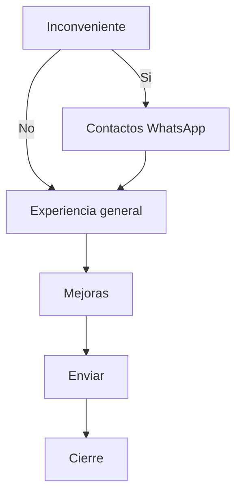

# Encuesta de seguimiento - 3er dia

## Archivo
- Crear [index.html](C:/Users/Usuario/Desktop/GastroBA/encuesta-de-exp-3er-dia/index.html) copiando [encuesta-de-exp/index.html](C:/Users/Usuario/Desktop/GastroBA/encuesta-de-exp/index.html) como base (mismo CSS, `LOCALES`, `EQUIPOS`, logica de zona/local y envio). La encuesta original no se toca.

## Orden final de pasos (17 preguntas)
1. Rol (igual)
2. Edad (igual)
3. Experiencia previa en fast-food (igual)
4. Marca (igual)
5. Zona y local (igual)
6. **Nueva - Recibimiento del 1er dia**: "Me recibieron y me presentaron al equipo" / "Me recibieron pero no me presentaron" / "Nadie me recibio"
7. **Nueva - Entrenador/a asignado**: "Si, me acompano todo el tiempo" / "Si, pero solo a ratos" / "No, aprendi con distintos companeros" / "No, estuve solo/a"
8. Entrenamiento (adaptado: "En estos 3 dias, como te ensenaron las tareas?")
9. **Nueva - Tareas aprendidas** (multiple + boton Continuar): Caja, Cocina/Plancha, Freidora, Armado de pedidos, Delivery/Drive, Limpieza, Atencion al cliente
10. **Nueva - Seguridad e higiene**: "Si, me lo explicaron bien" / "Me explicaron algo" / "No me explicaron"
11. **Nueva - Horarios, francos y fichaje**: "Si, me quedo todo claro" / "Algunas cosas" / "No me explicaron"
12. **Nueva - Descansos**: "Si, siempre" / "A veces" / "No"
13. Trato (adaptado a los primeros dias)
14. **Nueva - Referente**: "Si, se a quien recurrir" / "Mas o menos" / "No se a quien recurrir"
15. Inconveniente (Si / No)
16. *Contactos WhatsApp* - **solo si respondio "Si"** en la 15 (no cuenta como pregunta)
17. Experiencia general (estrellas, adaptada a "tus primeros 3 dias")
18. Mejoras (multiple) - sumar opciones "El recibimiento del primer dia" y "La explicacion de seguridad e higiene"

Se elimina la pregunta de antiguedad (y `antiguedad` del objeto `respuestas`).

## Cambios de logica en el script
- **Ramificacion**: en el handler de opcion unica, si `group.dataset.q === 'inconveniente'` y la respuesta es "No", saltar el paso de contactos (`go(indiceDe('general'))`).
- **Boton Volver con historial**: reemplazar `go(i - 1)` por una pila de pasos visitados, para que desde "general" vuelva a "inconveniente" si se salteo contactos.
- **Progreso**: el paso de contactos usa `data-step="contactos"`; `render()` mantiene visible la barra superior y el numero de la pregunta 15 mientras esta en ese paso. Contador `x/17`.
- **Multiple generico**: generalizar el handler de `.opt.multi` para que funcione con cualquier grupo (`data-q="tareas"` y `data-q="mejoras"`), guardando arrays y uniendolos con `" | "` en el payload.
- **Payload**: nuevos campos `recibimiento`, `entrenador`, `tareas`, `seguridad`, `horarios`, `descansos`, `referente`, mas `encuesta: '3er dia'`.

## Textos
- Intro: "Ya cumpliste tus primeros 3 dias" + "17 preguntas rapidas, menos de 3 minutos". Titulo de pagina: "Encuesta de seguimiento - 3er dia".

## Pendiente del lado de Rafael
- El Apps Script actual no esta en el repo: habra que agregar las columnas nuevas (o crear una hoja/despliegue nuevo) y pegar la URL en `APPS_SCRIPT_URL`. Mientras tanto dejo la URL vacia, y el codigo existente solo loguea el payload en consola.